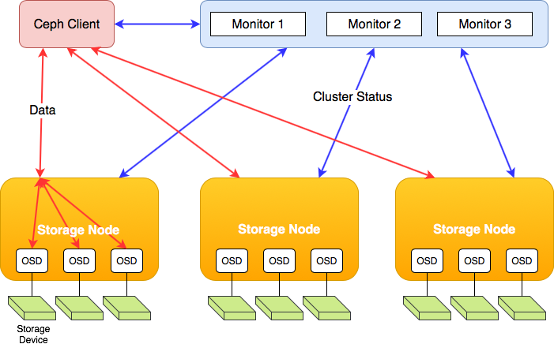
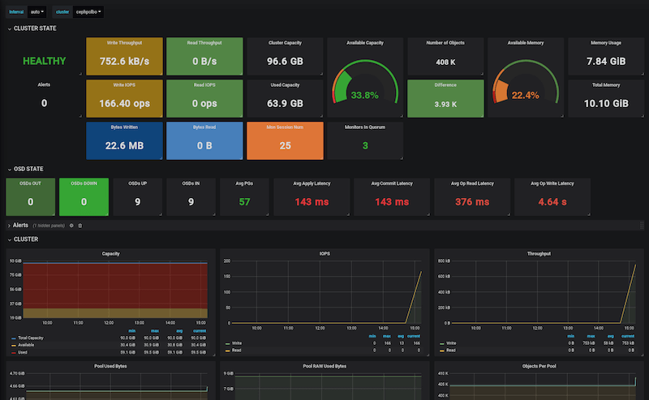

name: inverse
layout: true
class: center, middle, inverse

---
#Ceph Storage on a Budget
.pink[XXX XXX XXX]

Updated Jan 2020

FOSSASIA 2020 in Singapore

---
layout: false
.left-column[
  ## About Me
]
.right-column[
### Background
- First online startup: 2008 (tailor-made shirts)
- iViveLabs agency since 2012
- Founder of [BorgBase.com](https://www.borgbase.com) – backup hosting platform (used Ceph in production)
- Django & Vue.js mostly

### Notable Open Source/Community Projects
- **invoice2data**.red[a] – a Python library for extracting structured data from PDF invoices, used in Odoo ERP
- **Vorta**.red[b] – a Borg Backup desktop client in Python and Golang

.footnote[
  .red[a] [https://github.com/invoice-x/invoice2data](https://github.com/invoice-x/invoice2data)

  .red[b] [vorta.borgbase.com](https://vorta.borgbase.com)
  ]
]

---
.left-column[
  ## What to Expect
]
.right-column[
### Goals of this Talk
- Know your options when storing lots of data
- Plan, setup and run a Ceph cluster

### Contents
1. Alternatives
2. Deployment Planning
3. Setup with Ansible
4. Operation and Monitoring
5. Client Protocols
6. Expansion
7. Summary
]

---
.left-column[
## Alternatives
### RAID
]
.right-column[
### Hard Drives.red[a]
- Most economical way to store and access data
- They fail at about 2%/year, more often as they get older

### RAID
- Protect against HD failure and some downtime
- Not a backup, but improves availability
- Rebuild puts stress on system
- During rebuild all data needs to be read
- For large drives, read errors can prevent rebuild.red[b]
- Failure domain: single machine, no geographic redundancy
- Not high-availability (reboot for updates)

.footnote[
  .red[a] [Backblaze Drive Stats](https://www.backblaze.com/blog/backblaze-hard-drive-stats-q3-2019/)
  .red[b] [RAID rebuild failure chance calculator](https://magj.github.io/raid-failure/)
  ]
]
---
.left-column[
## Alternatives
### RAID
### Software Defined Storage
]
.right-column[
### Goals.red[a]
- Be independent of underlying hardware
- Scale horizontally
- Avoid single point of failure
- Custom failure domain (host, rack, DC, region)

### Implementations
- Ceph
- GlusterFS
- MooseFS
- StorPool

.footnote[
  .red[a] [Red Hat SDS](https://www.redhat.com/en/topics/data-storage/software-defined-storage)
  ]
]
---
.left-column[
## Planning
]
.right-column[
### Hardware and Network
- SSD or HDD (cheaper)
- Can use SSD for journal and OS, HDD for data
- Some RAM recommended (1GB/TB storage)

### Network
- 1Gbit minimum, 10Gbit better

### OS
- Supported by Red Hat, so CentOS
- Ubuntu also supported

]
---
.left-column[
## Planning
### Hardware
### Daemons
]
.right-column[
### Required Daemons

#### Monitor  (`mon`)
- Keep cluster state
- Min 3
- Small VPS with 4GB RAM works well

#### Manager (`mgr`)
- Used to be optional
- Provide interfaces to external services and additional monitoring
- Can run on the same VPS as `mon`

#### Metadata Server (`mds`)
- Required for CephFS
- Keeps data on files and folders
- Can also share a VPS with `mon`

#### OSD Host (`osd`)
- Accesses actual HDD (first XFS, now BlueStore)
- One process per HDD

]
---

.footnote[
  From: [Understanding Ceph: Open-Source Scalable Storage](https://louwrentius.com/understanding-ceph-open-source-scalable-storage.html)
]
---
.left-column[
## Planning
### Hardware
### Daemons
### Pools
]
.right-column[
## Pools and Replication
- A cluster can have multiple pools with different replication options.

### Option 1: Replication
- Files are replicated multiple times between error domains.
- Space usage: `r`, e.g. 300% for 3 replicas
- Makes sense for high-value data or if high availability across failure domains is needed.

### Option 2: Erasure Code
- Similar to RAID
- Allows for variable failure without losing data
- Define `k` (number of chunks) and `m` (additional parity chunks)
- Sample profiles: `2+1`, `4+2`, or `10+4`
- Space usage: `(k+m)/k`, e.g. 140% for `10+4` or 150% for `4+2`
- Supposedly more CPU-intensive, but didn't see this in practice.

]
---
.left-column[
## Planning
### Hardware
### Daemons
### Pools
]
.right-column[
## Sample Setup (EC Pool)

Create EC profile with OSD as failure domain (can lose 2 OSDs, not recommended)

`$ ceph osd erasure-code-profile set ecprofile k=4 m=2 crush-failure-domain=osd`

Create new pool using profile and 256 PGs

`$ ceph osd pool create ecpool 256 256 erasure ecprofile`

List pools

`$ ceph osd lspools`

]
---
.left-column[
## Planning
### Hardware
### Daemons
### Pools
### Services
]
.right-column[
## Client-facing Services
Ceph supports different data services:

### Object Storage
- Like S3
- Read and write single files via REST interface

### Block Device (RBD)
- A block device mounted over the network
- Useful for VMs or if you want separate file systems

### CephFS
- POSIX-compliant file system
- Native support in most newer Linux kernels
- Can have high latency for random IO, sequential IO is OK

]
---
.left-column[
## Planning
### Hardware
### Daemons
### Pools
### Services
### Tips
]
.right-column[
## Tips for Low-Cost Setup

- Use EC pools for drastically lower space usage
- Use the highest failure domain you can afford
- Put `mon`, `mds` and `mgr` all on the same machine
- Use BlueStore for best performance
- On a slower network, it's OK to co-locate OS, journal and data on the same drive
- Benchmark:

```bash
$ ceph tell osd.5 bench
{
    "bytes_written": 1073741824,
    "blocksize": 4194304,
    "elapsed_sec": 19.14666016,
    "bytes_per_sec": 56079849.698444746,
    "iops": 13.370478081332385
}
```

]
---
.left-column[
## Operation
### Setup
]
.right-column[
## Initial Setup with Ansible

### Ceph-Ansible
- Ansible is the recommended way for setup
- Versions of Ceph-Ansible, Ceph and Ansible need to match
- You will profit from many optimizations contained in playbooks
- Also useful to add nodes later
- Best support for CentOS, Red Hat and Ubuntu

#### Rough Steps:
1. Add inventory file with `mons`, `osds`, `clients` and others.
2. Copy and customize `group_vars`.
3. Run `site.yml` (usually needs no customization)

]
.footnote[
  .red[a][Ceph-Ansible](https://docs.ceph.com/ceph-ansible/master/)
]
---
.left-column[
## Operation
### Setup
### Monitor
]
.right-column[
## Monitoring a Production Cluster

### Ceph Dashboard
- Provided by `mgrs`, relatively recent addition

### Grafana with Prometheus
- `mgrs` expose a Prometheus interface
- Use Grafana to visualize.red[a] and send alerts



]
.footnote[
  .red[a][Grafana Dashboard](https://grafana.com/grafana/dashboards/7056)
]
---
.left-column[
## Operation
### Setup
### Monitor
### Expand
]
.right-column[
## Expanding an Existing Cluster
- Save money by only adding the capacity you need
- Grow cluster over time to match client demand

### CRUSH Map
- How a cluster distributes data.
- Possible to adjust distribution and failure domain as cluster grows
- E.g. poor man's redundancy with `4+2` EC pool

```bash
step choose indep 3 type host
step choose indep 2 type osd
```

### Placement Groups
- Group objects together for better handling
- Aim for about 200 PGs per OSD
- Grow PGs over time: `$ ceph osd pool set ecpool pg_num 260`

]
.footnote[
  .red[a][PG Calculator and Recommendations](https://access.redhat.com/solutions/2457321)
]
---
.left-column[
## Operation
### Setup
### Monitor
### Expand
### Tips
]
.right-column[
## Tips for operating a Cluster

- For smaller clusters, add `osd`s with weight = 0 and slowly increase..red[a]
- Start with PGs on the high side to avoid reshuffling later
- Take monitoring seriously.
- Adjusting the CRUSH map can cause big data shifts.
- Limit impact on client performance: 

```bash
$ ceph tell osd.* injectargs \
  --osd-max-backfills 3 \
  --osd_recovery_max_active 8 \
  --osd_recovery_op_priority 10
```
]

.footnote[
.red[a] [CERN Ceph Scripts](https://github.com/cernceph/ceph-scripts)
]
---
## Summary

### Alternatives
- When considering RAID, be aware of the drawbacks.
- Software-defined storage offers benefits in availability and scalability

### Planning a Cluster
- Ceph is generally flexible and allows cutting many corners
- Tailor failure domains and availability to client use
- Start with test cluster and benchmark it

### Operating a Cluster
- Ceph-Ansible for Setup
- Grafana + Prometheus for monitoring
- Possible to expand as needed

---
name: inverse
class: center, middle, inverse
## Questions?

Contact: .pink[manu(at)snapdragon.cc]

Slides: .pink[https://m3nu.github.io/talks/]
