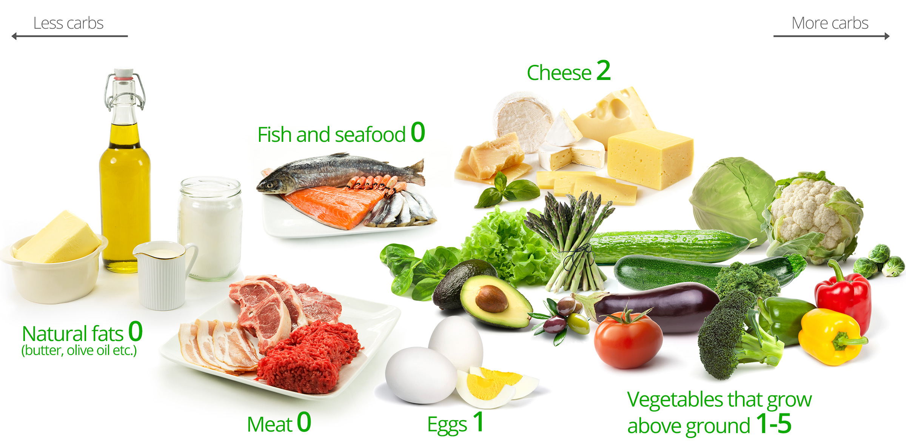
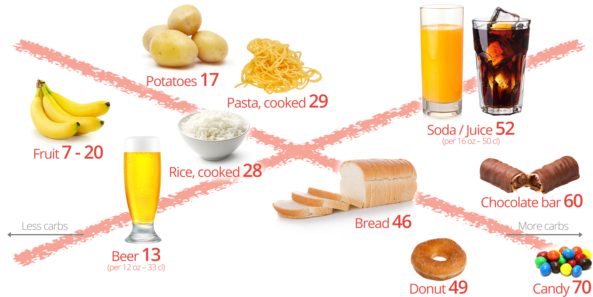

name: inverse
layout: true
class: center, middle, inverse

---
#Ketogenic Diet 101
.pink[Improve your health and mental performance]

Updated Oct 2016

---
layout: false
.left-column[
  ## Disclaimer
]
.right-column[
## This is not medical advice.
- Consult with a doctor before making dietary changes.
- Beware that most doctor's aren't trained in nutrition.
- Don't trust anything you read online.
- Don't trust me.
]

---
.left-column[
  ## Benefits
]
.right-column[
### What to gain from a low-carb lifestyle?
- naturally control your weight and prevent obesity.red[a, j]
- improve memory and brain function.red[b]
- prevent modern chronic metabolic disease like 
  - type 2 diabetes.red[c]
  - Alzheimer's.red[d, i] and Parkinson.red[h]
  - heart attack, stroke and CVD.red[e]
- slow aging.red[f] and support apoptosis and autophagy
- reduce migraines and other neurological disease.red[g]

.footnote[
  .red[a] Affects 49% of women, 44% of men in MY, according to [The Star](http://www.thestar.com.my/news/nation/2014/06/16/obesity-malaysia-highest-in-asia-says-pm-science-advisor/)
  
  .red[b] *Caloric restriction improves memory in elderly humans*, Witte et al.
  
  .red[c] Affects 3.3 million people in Malaysia, see [idf.org](http://www.idf.org/membership/wp/malaysia)
  
  .red[d] [Affects](http://www.worldlifeexpectancy.com/malaysia-coronary-heart-disease) 50,000+ people in Malaysia

  .red[e] [Responsible](http://www.worldlifeexpectancy.com/malaysia-coronary-heart-disease) for 45% of deaths in Malaysia.

  .red[f] *Mitochondria—A Nexus for Aging, Calorie Restriction, and Sirtuins?*, Guarente

  .red[g] *Cortical functional correlates of responsiveness to short-lasting preventive intervention with ketogenic diet in migraine*, Di Lorenzo et al.

  .red[h] *Parkinson's disease, insulin resistance and novel agents of neuroprotection*, Aviles-Olmos et al.

  .red[i] *Alzheimer's Disease Is Type 3 Diabetes–Evidence Reviewed*, De la Monte and Wands

  .red[j] *Effects of a low-carbohydrate diet on weight loss and cardiovascular risk factor in overweight adolescents*, Sondike et al.
  ]
]
---
.left-column[
## Why it Works
### Primary effects
]
.right-column[
### Primary effects of carb restriction
- Keep glucose, keep insulin low
- Body oxidizes fat instead of storing it.
- No glucose/insulin fluctuations > stable energy
- No development of insulin resistance > avoid all kinds of diabetes.
- Fat is a cleaner fuel.red[a, b, c, d, e] > fewer free radicals, less inflammation, more capacity for repair work.

.footnote[
  .red[a] Carbs only give 4 calories energy per g vs 9 cal/g for fat. While burning fat, 30% less carbonoxide is produced which points to fewer by-products.

  .red[b] *Comparison of Low Fat and Low Carbohydrate Diets on Circulating Fatty Acid Composition and Markers of Inflammation*, Forsythe et al.

  .red[c] *Ketones inhibit mitochondrial production of reactive oxygen species production following glutamate excitotoxicity by increasing NADH oxidation*, Maalouf et al.

  .red[d] *The Art and Science of Low Carbohydrate Living*, Volek and Phinney, chapter 7
  ]
]
---
.left-column[
## Why it Works
### Primary effects
### Secondary benefits
]
.right-column[
### Secondary benefits of a low-carb diet
- Avoid fructose > useless to the body, processed like alcohol, stored as visceral fat around organs.
- Avoid wheat > reduce chronic inflammation of the gut.red[a]
- Avoid polyunsaturated fat > reduce cancer risk and inflammation.red[e]
- More nutritionally dense food > improved micros
- Reduced appetite > easy fasting > autophagy.red[b] and apoptosis.red[c]
- Fewer fermentable carbohydrates > less tooth decay and caries.red[d]

.footnote[
  .red[a] *The Dietary Intake of Wheat and other Cereal Grains and Their Role in Inflammation*, De Punder and Pruimboom

  .red[b] *Autophagy and Aging: The Importance of Maintaining "Clean" Cells*, Cuervo

  .red[c] *The Complete Guide to Fasting*, Fung, chapter 7

  .red[d] *Earliest evidence for caries and exploitation of starchy plant foods in Pleistocene hunter-gatherers from Morocco*, Humphrey et al.

  .red[3] *Current Evidence Linking Polyunsaturated Fatty Acids with Cancer Risk and Progression*, Azrad et al.
  ]
]
---
.left-column[
## How-To
### Getting Started
]
.right-column[
### Reduce carbohydrates by chaning your macro-nutrients

3 macro-nutrients:
- *Protein*: Usually constant at ~1g/kg body weight
- *Carbohydrates*: Intake dramatically increased since 1960s..red[a]
- *Fat*: Safest food of all, no insulin reaction, clean and efficient fuel

How to start your ketogenic diet:
- Shift macros from carbs to fat, protein constant
- Less than 30-50g net carbs per day
- Measure urine ketones in the first weeks
- 2 weeks adaption phase, ~10% weight loss
- Short fasting periods, e.g. 16:8 hours
- Track food intake in the first weeks

.footnote[
  .red[1] Possible Reasons: agricultural subsidies, misguided dietary recommendations, industry lobbying, unfounded fear of fat.
]

]
---
## Low-carb foods

.footnote[From [https://www.dietdoctor.com/low-carb](https://www.dietdoctor.com/low-carb)]
---
## High-carb foods

.footnote[From [https://www.dietdoctor.com/low-carb](https://www.dietdoctor.com/low-carb)]
---
.left-column[
## How-To
### Getting Started
### Low-carb foods
### High-carb foods
### What to eat
]
.right-column[
Safe to eat:
- saturated and monounsatured fat: animal fat, coconut cream and oil, dark chocolate (>85%), olive oil, avocados
- non-starchy (green) vegetables: spinach, salad, ...
- meat: beef and lamb
- oily fish: tuna, mackerel, sardines, salmon
- berries, eggs, fatty nuts

These foods should be avoided:
- all sugar, added sugar and sugar-drinks
- high-gycemic index.red[a] food
- wheat, starches, rice, legumes
- fruits, fructose, high-fructose corn syrup, all fruit smoothies
- polyunsaturated fats (especially omega-6), especially from vegetable oils
- most dairy, except old cheese

.footnote[
  .red[a] High-GI foods rise your glucose level faster, thus triggering a stronger insulin response.
  ]
]
---
.left-column[
## Markers
]
.right-column[
Track your progress using these markers.
- waist/height ratio `< .45`: unhealthy fat will gather around the waist, free to measure.
- blood pressure `< 120/80`: Elevation can be a sign of atherosclerosis.
- Triglycerides/HDL `< 1.5`: Rough estimator of insulin resistance and LDL particle size.
- fasting insulin `< 8`
- HDL `> 65`: Has many useful functions, can reverse atherosclerosis, can be increased by eating saturated and monounsatured fats, exercise and *moderate* amounts of red wine.
- HbA1c `< 4.5%`: Long-term blood glucose.
- hs-CRP `< .1`: Inflammation marker, elevated when consuming PUFA and wheat.
- TSH `< 1`: Thyroid-stimulating hormon, should be low for good thyroid/immune system function.

Irrelevant markers:
- total cholesterol
- LDL cholesterol, LDL particle size is more relevant.

]
---
.left-column[
## More Resources
]
.right-column[
### Books
- The Art and Science of Low Carbohydrate Living, Volek and Phinney
- The Complete Guide to Fasting, Jason Fung
- Essentials of Human Nutrition, Mann and Truswell

### Websites
- Reddit [https://www.reddit.com/r/ketoscience/](https://www.reddit.com/r/ketoscience/)
- Pubmed [https://www.ncbi.nlm.nih.gov/pubmed](https://www.ncbi.nlm.nih.gov/pubmed)

### Videos and documentaries
- *SUGAR as a primary Root Cause of Metabolic Syndrome and the Obesity/Diabetes Epidemic*, Cummins, on [Youtube](https://www.youtube.com/watch?v=xrsHqIKtXNw)
- *Sugar: The bitter Truth*, Dr. Lustig, on [Youtube](https://www.youtube.com/watch?v=dBnniua6-oM)
- [Cereal Killers 1 & 2](http://www.runonfatmovie.com/)
]
---
name: inverse
class: center, middle, inverse
##Q&A Session
---
name: inverse
class: center, middle, inverse
##Thanks for coming

.pink[manu@vlx.cc]

.pink[https://m3nu.github.io/talks/?u=keto.md]
